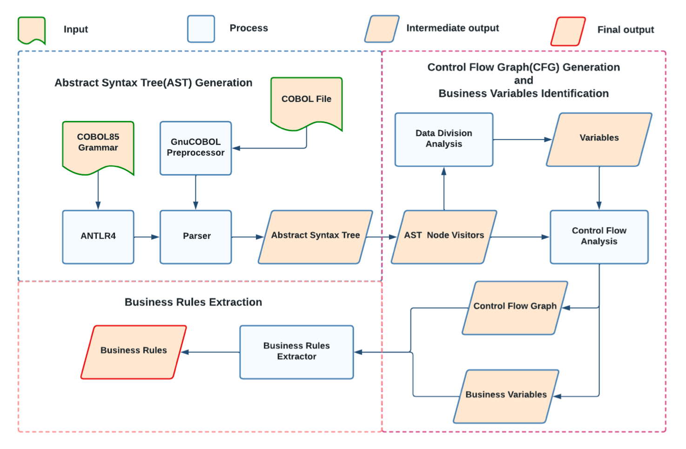
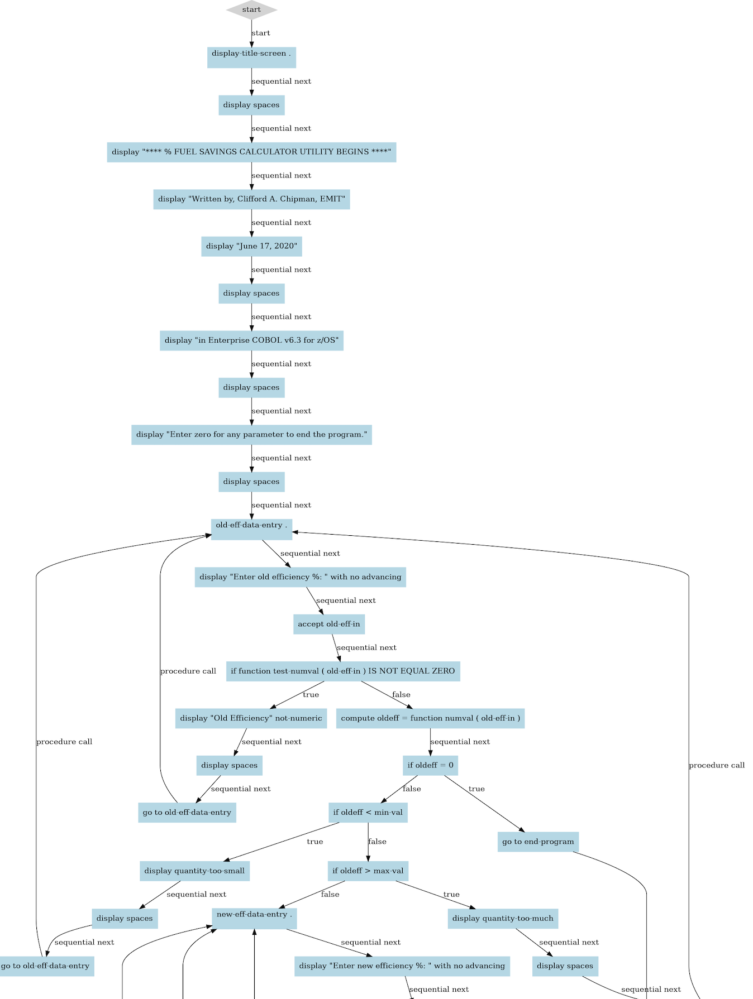
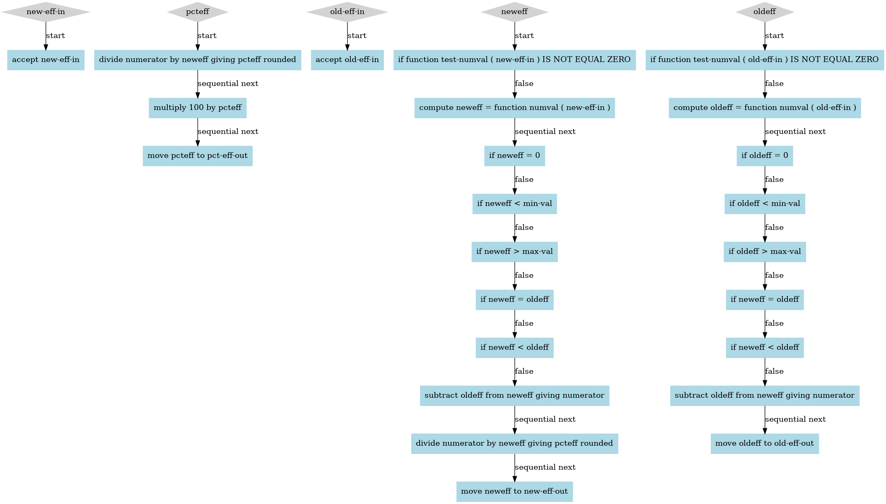

# COBREX
## What is COBREX?
COBREX is a tool for building the Control Flow Graph (CFG) of an input COBOL program and extracting the embedded business rules. COBREX outputs the CFG as well as the business rules in JSON and PDF format. 

## Features of COBREX:
1. Constructs Control Flow Graph (CFG) of the input COBOL program.
2. Extracts the business rules embedded in the input COBOL program.
3. COBREX outputs the CFG as well as the business rules in four files. The table below lists the output files and their descriptions.

| File Name               | Description                                                  |
|-------------------------|--------------------------------------------------------------|
| input_filename_CFG.json | Constructed CFG in JSON format                               |
| input_filename_CFG.pdf  | Constructed CFG visualized and stored in PDF format          |
| input_filename_BRs.json | Extracted business rules in JSON format                      |
| input_filename_BRs.pdf  | Extracted business rules visualized and stored in PDF format |

## Uses of COBREX:
The business logic incorporated in the source code is known as business rules. Understanding these business rules can aid with source code comprehension. An essential stage in legacy system migration is extracting business rules from existing COBOL systems. To this end, we present COBREX, an open-source tool for building the CFG of an input COBOL program and extracting the embedded business rules.

COBOL developers can use COBREX to extract business rules of a COBOL program and can analyze the extracted business rules to comprehend the COBOL program.

These extracted business rules can also aid COBOL developers in bug location and resolution in turn helping them in maintenance of COBOL legacy systems.

## Working of COBREX:
COBREX has been developed using Python using the following approach:

COBREX can be divided into three main phases as illustrated in the above figure. 
### 1. Abstract Syntax Tree (AST) Generation
In the first phase, ANTLR4 is used to create a COBOL parser using the COBOL85 grammar. The input COBOL program is preprocessed using the GnuCOBOL pre-processor. Then, the pre-processed file is processed by the parser to produce the AST. 

### 2. Control Flow Graph (CFG) Generation & Business Variables Identification 
In the next phase, we override the AST node visitor methods present in the visitor class created by ANTLR4. We utilise these AST node visitor methods to perform COBOL data division analysis, identify business variables and construct the Control Flow Graph(CFG). We also identify the context statements for each COBOL statement present in the input COBOL program.

### 3. Business Rules Extraction
In this phase, we extract the business rules of the input business variables using the constructed CFG.
All statements and their corresponding context statements of a business variable are added to a Rules set.
Depth First Search (DFS) is performed on the CFG to identify and add the control flow between the statements present in the Rules set.

## CFG generated and business rules extracted for [FUELSAVE.cbl](https://github.com/cchipman21804/EnterpriseCOBOLv6.3/blob/master/cbl/FUELSAVE.cbl)
### 1. A portion of generated Control Flow Graph (CFG)

### 2. Business rules for the variables new-eff-in, pcteff, old-eff-in, neweff and oldeff present in FUELSAVE.cbl

## How to contribute to COBREX?
We will be very happy to receive any kind of contributions. Incase of a bug or an enhancement idea or a feature improvement idea, please open an issue or a pull request. Incase of any queries or if you would like to give any suggestions, please feel free to contact Mir Sameed Ali (cs18b021@iittp.ac.in) or Nikhil M (cs18b041@iittp.ac.in) or Sridhar Chimalakonda (ch@iittp.ac.in) of RISHA Lab, IIT Tirupati, India.
